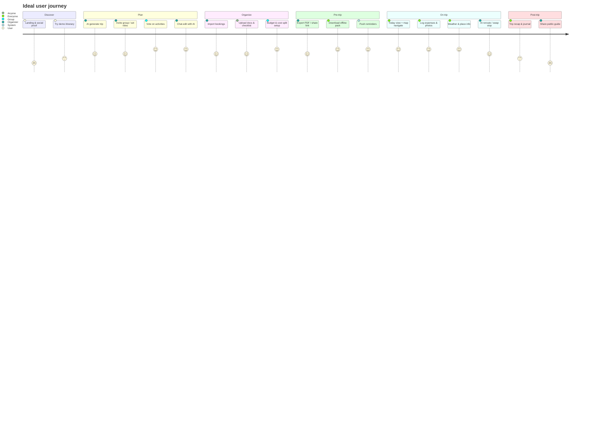
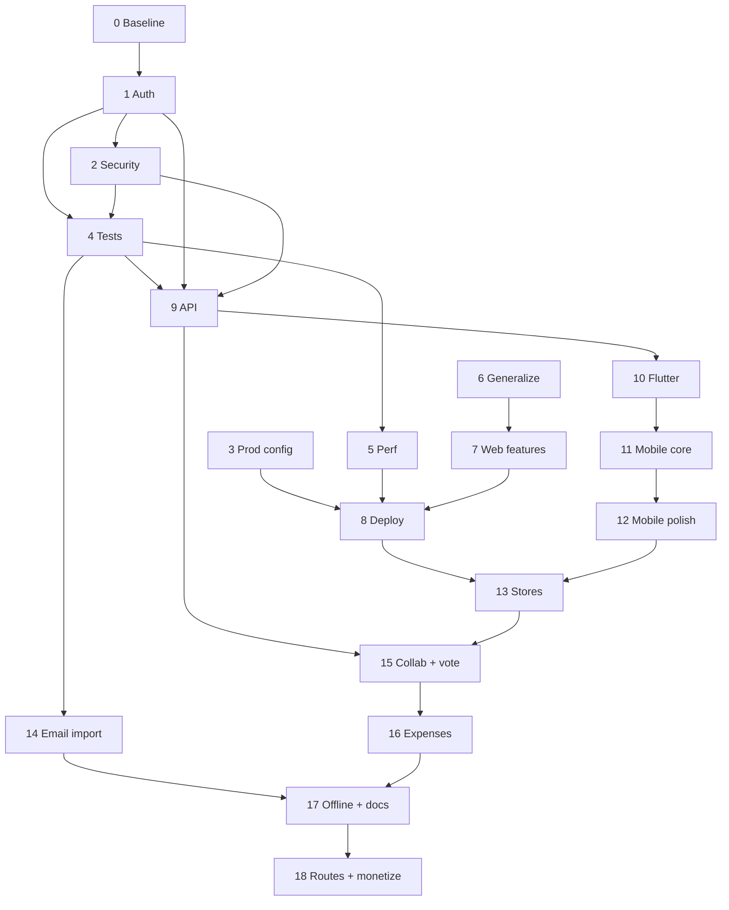

# Trip Planner — Master Plan

**Single source of truth** for product vision, competitive strategy, user journey, feature priorities, and phased delivery.

| Document | Role |
|----------|------|
| **This file** | Vision, journey, market research, feature gap, unified timeline, milestones |
| [Annex A: Engineering Hardening](./ROADMAP.md) | Phases 0–8 — security, quality, web deploy (SMART goals) |
| [Annex B: API & Flutter Mobile](./MOBILE_FLUTTER.md) | Phases 9–13 — REST API + companion app (SMART goals) |
| [Annex C: Product Features](./PRODUCT_FEATURES.md) | Phases 14–18 — market-competitive capabilities (SMART goals) |

**Repo layout (target):** Django at root · `itinerary/api/` (Phase 9) · `mobile/` Flutter (Phase 10) · `plan/` docs.

---

## 1. Product vision

Build an **AI-native trip planner** for families and small groups that replaces the typical 4-app stack (Google Doc + Maps + Splitwise + TripIt) with one experience on **web + mobile**.

**Positioning statement:**  
*"Generate a real day-by-day plan in minutes, let your group shape it together, then carry it offline on your phone—with an AI assistant that edits the agenda in plain English."*

**Differentiators to own (vs market):**

| Our edge | Why it matters |
|----------|----------------|
| **Conversational AI agenda editing** | Wanderlog/TripIt are manual drag-drop; MonkeyTravel is generate-once; we already have chat-edit |
| **Family-aware AI** (attendees, toddler tips, meals) | Underserved vs generic solo-backpacker AI |
| **Calendar timeline + map sync** | Richer day view than list-only competitors |
| **Group consensus** (Phase 15) | MonkeyTravel's wedge; we add it to a full itinerary product |
| **One repo, web + Flutter** | TripProf's all-in-one promise with open self-host path |

**Market gap to exploit** (TripProf 2026 analysis): *no single app nails planning + expenses + guides + offline on iOS and Android*. We do not need all eight on day one—we sequence toward it.

---

## 2. Ideal user journey

Six stages. Each maps to phases later in this document.

### Stage detail

| Stage | User goal | Key screens | Success signal |
|-------|-----------|-------------|----------------|
| **1. Discover** | Trust the product before signup | Landing, sample trip, pricing | Visitor → register ≥15% |
| **2. Plan** | Go from idea → draft itinerary fast | Create trip, day map, AI chat | First itinerary &lt;3 min |
| **3. Organize** | Centralize bookings, docs, packing | Bookings tab, checklist, documents | ≥1 booking imported per trip |
| **4. Pre-trip** | Group aligned; ready offline | Share link, PDF, offline download | ≥2 collaborators on group trips |
| **5. On trip** | Execute day plan without friction | Mobile today view, map, expenses | DAU on trip dates |
| **6. Post-trip** | Remember and inspire others | Photo journal, share recap | ≥20% trips get shared |

**Primary persona (v1):** Family organizer (25–45) planning a 3–14 day vacation with partner/kids.  
**Secondary persona (v1.5):** Friend group organizer (4–8 people) needing votes, not chat chaos.

---

## 3. Competitive research

Research date: **June 2026**. Sources: [TripProf comparison](https://tripprof.com/en/blog/best-trip-planning-apps-2026/), Google Play / App Store listings, product sites.

### Top 5 — Google Play (travel planner category)

| Rank | App | Rating | Scale | Core strength |
|------|-----|--------|-------|----------------|
| 1 | **Wanderlog** | 4.7★ | 3.4M+ downloads | Map itinerary, collaboration, email import, route optimize |
| 2 | **TripIt** | 4.7★ | 5M+ downloads | Auto-parse confirmation emails → timeline |
| 3 | **Lambus** | 4.3★ | 100K+ downloads | Documents vault, GPX routes, expense split |
| 4 | **Stippl** | 3.8★ | 100K+ downloads | AI plan, budget, packing, social reels |
| 5 | **Layla AI** | ~5.0★ | Smaller base | Conversational AI + live pricing/booking |

### Top 5 — Apple App Store (travel planner)

| Rank | App | Rating | Notes |
|------|-----|--------|-------|
| 1 | **Wanderlog** | 4.9★ | Editors' Choice; offline Pro |
| 2 | **TripProf** | 4.9★ | All-in-one: guides, expenses, offline, collab |
| 3 | **TripIt** | 4.8★ | Business traveler standard |
| 4 | **Tripsy** | 4.8★ | Apple-only polish, email import |
| 5 | **Lambus** | 4.5★ | Group expenses + documents |

### AI / group challengers (web-first, mobile coming)

| App | Wedge | Gap we can beat |
|-----|-------|-----------------|
| **MonkeyTravel** | AI + group voting, free, no app yet | Full native mobile + deeper itinerary UX |
| **Hoku** | AI + group + Viator booking + expenses | Stronger day-level editing & map timeline |

### Eight features travelers expect (industry framework)

From TripProf's 2026 framework—used for our gap matrix below:

1. Itinerary builder (day-by-day, drag-drop, map)
2. Expense tracking (multi-currency, split)
3. Destination guides (structured, personalized)
4. Packing checklists (smart, shared)
5. Document storage (passport, confirmations)
6. Collaboration (real-time, roles)
7. Offline access
8. Maps integration (routing between stops)

---

## 4. Feature assessment

**Legend:** ✅ Have · 🟡 Partial / stub · ❌ Missing · 🎯 Planned phase

| Feature | Us today | Wanderlog | TripIt | MonkeyTravel | Target phase |
|---------|----------|-----------|--------|--------------|--------------|
| AI generate itinerary | ✅ | 🟡 Pro AI | ❌ | ✅ | — |
| AI chat-edit day | ✅ | ❌ | ❌ | 🟡 | — |
| Day-by-day plan | ✅ | ✅ | ✅ | ✅ | — |
| Map + markers | ✅ | ✅ | 🟡 | ✅ | 11 |
| Calendar time blocks | ✅ | ✅ | ❌ | 🟡 | 12 (mobile read) |
| Drag reorder stops | ✅ | ✅ | ❌ | ✅ | 11 |
| Multi-currency costs | 🟡 display | 🟡 basic | ❌ | ✅ | 16 |
| Expense splitting | ❌ | 🟡 Pro | ❌ | ❌ | 16 |
| Checklist | 🟡 generic | ❌ | ❌ | ❌ | 17 |
| Booking model | 🟡 | ✅ import | ✅ email | ❌ | 14, 17 |
| PDF booking import | 🟡 stub | ❌ | ✅ | ❌ | 17 |
| Email booking import | ❌ | ✅ | ✅ | ❌ | 14 |
| Place reviews/photos | 🟡 + mocks | ✅ | ❌ | ✅ verified | 3, 12 |
| Weather | 🟡 + mocks | ❌ | 🟡 | ❌ | 12 |
| User photos per stop | ✅ | ❌ | ❌ | ❌ | 12 |
| Group collaboration | ❌ | ✅ | 🟡 share | ✅ vote | 15 |
| Invite link / roles | ❌ | ✅ | ❌ | ✅ | 15 |
| Activity voting | ❌ | ❌ | ❌ | ✅ | 15 |
| Offline mode | ❌ | ✅ Pro | ✅ | ❌ | 17 |
| PDF / share export | ❌ | 🟡 | ✅ | ✅ | 16 |
| Route optimization | ❌ | ✅ | ❌ | 🟡 | 18 |
| Document vault | 🟡 model only | ❌ | ❌ | ❌ | 17 |
| Destination guides | ❌ | 🟡 community | ❌ | ❌ | 18 |
| Native iOS/Android | ❌ | ✅ | ✅ | 🟡 web | 9–13 |
| Auth / multi-user | 🟡 broken IDOR | ✅ | ✅ | ✅ | 1 |
| Push notifications | ❌ | 🟡 | ✅ Pro | ❌ | 17 |
| Monetization | ❌ | $40/yr Pro | $49/yr Pro | Free | 18 |

### Competitive scorecard (rough)

| Capability | Us now | Market leader | Gap |
|------------|--------|---------------|-----|
| AI planning + edit | **Strong** | Layla / MonkeyTravel | Keep quality; verified places |
| Map itinerary | Good (web) | Wanderlog | Mobile + routing |
| Collaboration | None | MonkeyTravel / Wanderlog | **Largest product gap** |
| Booking ingest | Weak | TripIt | Email forward + PDF |
| Expenses | Weak | Lambus / Stippl | Split + track on trip |
| Offline | None | Wanderlog / TripProf | **Required for v1.5** |
| All-in-one | 4/8 features | TripProf 8/8 | Phases 14–18 |

---

## 5. Unified delivery roadmap

All phases in order. **Drill-down SMART goals** live in annexes—this section is the schedule of record.

### Stream A — Foundation (must ship first)

| Phase | Name | Annex | Duration | Milestone |
|-------|------|-------|----------|-----------|
| 0 | Baseline & docs | A | 2–3 days | Runnable README |
| 1 | Authorization / IDOR | A | 1 week | **M1 Alpha** gate |
| 2 | XSS + LLM safety | A | 1 week | |
| 3 | Prod config + secrets | A | 4–5 days | |
| 4 | Tests + CI | A | 1 week | **M1 Alpha** complete |

### Stream B — Platform (web scale + API + mobile)

| Phase | Name | Annex | Duration | Milestone |
|-------|------|-------|----------|-----------|
| 5 | Performance + async AI | A | 1 week | |
| 6 | Product generalization | A | 1 week | |
| 7 | Feature completeness (web) | A | 1.5 weeks | |
| 8 | Web deployment | A | 1 week | **M2 Beta** (web) |
| 9 | REST API + JWT | B | 1.5 weeks | API contract locked |
| 10 | Flutter foundation | B | 1 week | |
| 11 | Core mobile screens | B | 2 weeks | |
| 12 | Mobile polish + offline read | B | 1.5 weeks | |
| 13 | App store internal release | B | 1 week | **M3 v1.0** |

### Stream C — Market competitiveness

| Phase | Name | Annex | Duration | Milestone |
|-------|------|-------|----------|-----------|
| 14 | Booking email import | C | 1 week | |
| 15 | Group collaboration + voting | C | 2 weeks | **M3 v1.0** differentiator |
| 16 | Expenses, split, export | C | 1.5 weeks | **M4 v1.5** |
| 17 | Offline pack, docs, push | C | 2 weeks | **M4 v1.5** complete |
| 18 | Routes, guides, monetization | C | 2 weeks | **M5 v2.0** |

### Parallelization rules

- **Never start 9 or 15 before 1** (auth must be solid).
- **15 (collab) needs 9** (API for mobile sync).
- **14 (email import) can start after 4**; parallel with 5–8.
- **16–18 can overlap** after 13; prioritize 15 before 18.
- Web **6–7** can run parallel with **9–11**.

### Master dependency graph

---

## 6. Release milestones

| Milestone | Phases | What users get | Competitive bar |
|-----------|--------|----------------|-----------------|
| **M0 Now** | — | Web prototype, AI plan, map, checklist | Below market (no security, no mobile) |
| **M1 Alpha** | 1–4 | Trustworthy web app for solo organizer | Matches basic SaaS hygiene |
| **M2 Beta** | 5–8 + 9 | Staging web + API ready | Wanderlog web parity (solo) |
| **M3 v1.0** | 10–13 + 15 | iOS/Android companion + group voting | MonkeyTravel + Wanderlog lite |
| **M4 v1.5** | 14, 16, 17 | TripIt-style import, Splitwise-lite, offline | Lambus / Stippl feature band |
| **M5 v2.0** | 18 | Route optimize, guides, Pro tier | TripProf / Wanderlog Pro chase |

**Part-time estimate:** ~22 weeks to M3 v1.0 · ~32 weeks to M5 v2.0 (after M1).

---

## 7. Monetization strategy (v2.0 / Phase 18)

Align with market: freemium + Pro subscription.

| Tier | Price anchor | Includes |
|------|--------------|----------|
| **Free** | $0 | 3 active trips, AI generate (rate-limited), 2 collaborators, web + mobile |
| **Pro** | ~$39–49/yr (Wanderlog/TripIt band) | Unlimited trips, offline pack, email import, expense split, export PDF, priority AI |
| **Never paywall** | — | Core safety, ownership, basic checklist, map view |

---

## 8. Success metrics

| Metric | Now | M1 Alpha | M3 v1.0 | M5 v2.0 |
|--------|-----|----------|---------|---------|
| IDOR vulnerabilities | Many | 0 | 0 | 0 |
| Automated tests | 0 | ≥28 | ≥55 | ≥80 |
| App Store / Play internal | — | — | Both | Public |
| Feature framework (of 8) | 4/8 partial | 4/8 | 6/8 | 8/8 |
| Group trip activation | 0% | — | ≥30% trips ≥2 members | ≥50% |
| AI itinerary → customize | — | ≥70% | ≥80% | ≥85% |
| Offline trip opens (mobile) | — | — | ≥60% pre-trip | ≥80% |

---

## 9. Execution prompts (by milestone)

**M1:** Execute [Annex A Phases 1–4](./ROADMAP.md#phase-1--authorization--data-ownership-critical).

**M2:** Annex A Phases 5–8 + [Annex B Phase 9](./MOBILE_FLUTTER.md#phase-9--shared-rest-api-backend).

**M3:** Annex B Phases 10–13 + [Annex C Phase 15](./PRODUCT_FEATURES.md#phase-15--group-collaboration--voting).

**M4–M5:** Annex C Phases 14, 16–18.

---

## 10. Audit lineage

This master plan subsumes the June 2026 security audit and mobile plan without repeating their SMART goal text. Implementation detail:

- Security findings → Annex A Phases 1–3
- Flutter companion → Annex B
- Market gaps → Annex C

**Last updated:** June 2026
