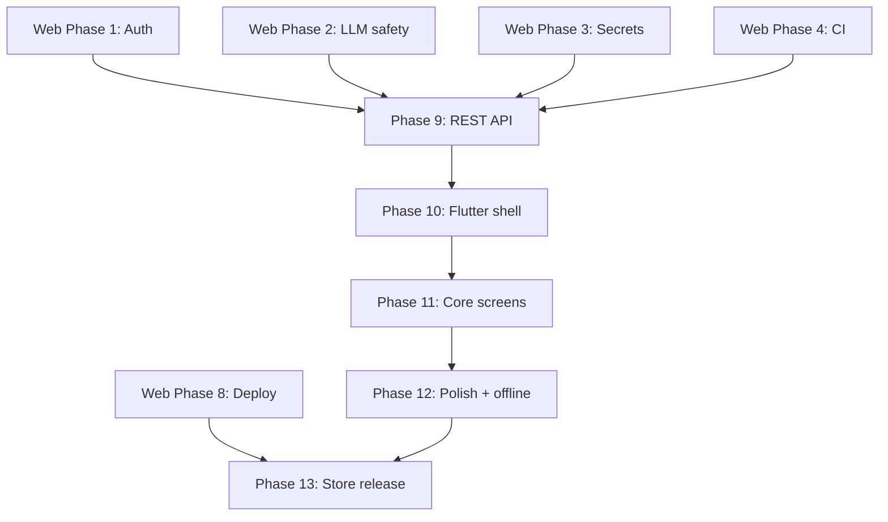

# Flutter Companion Mobile App — Plan

Add a **Flutter hybrid companion app** (iOS + Android from one codebase) that shares the **same Django backend** as the existing web app. One repo, one API, one domain model — web keeps HTMX templates; mobile consumes JSON.

---

## Strategy

| Layer | Technology | Role |
|-------|------------|------|
| Web (existing) | Django templates + HTMX + Alpine + Leaflet | Full planner UI in browser |
| API (new) | Django REST Framework on `/api/v1/` | Shared contract for mobile (and future clients) |
| Mobile (new) | Flutter 3.x (`mobile/`) | Companion: view trips, map, checklist, notes, AI edits on the go |
| Backend logic | `itinerary/services/` (LLM, etc.) | Unchanged; called from web views **and** API views |

**“Hybrid” here means:** one Flutter codebase compiles to native iOS and Android (optional Flutter web target later — not a replacement for the Django web UI in v1).

**Companion, not clone:** v1 mobile focuses on **read + light edit** (notes, checklist, chat-edit, map navigation). Heavy calendar drag-resize and admin stay web-first until Phase 12.

---

## Monorepo layout

Django stays at the repo root (no backend folder move). Flutter lives in `mobile/`.

```
trip_planner_app/
├── plan/
│   ├── ROADMAP.md              # Web hardening + master timeline
│   └── MOBILE_FLUTTER.md       # This document
├── core/                       # Django project
├── itinerary/                  # Django app (models, services, views, api/)
├── templates/
├── static/
├── mobile/                     # NEW — Flutter companion app
│   ├── pubspec.yaml
│   ├── analysis_options.yaml
│   ├── lib/
│   │   ├── main.dart
│   │   ├── app.dart
│   │   ├── config/             # env, API base URL
│   │   ├── api/                # Dio client, interceptors, DTOs
│   │   ├── models/             # Dart models (mirror API serializers)
│   │   ├── repositories/
│   │   ├── providers/          # Riverpod or Bloc
│   │   ├── screens/
│   │   └── widgets/
│   ├── test/
│   ├── android/
│   └── ios/
├── .github/workflows/
│   ├── ci.yml                  # Django: test, check
│   └── mobile.yml              # Flutter: analyze, test
├── pyproject.toml
└── README.md                   # Root runbook: backend + mobile
```

### `.gitignore` additions (when `mobile/` is created)

```
mobile/.dart_tool/
mobile/build/
mobile/.flutter-plugins
mobile/.flutter-plugins-dependencies
mobile/**/Generated.xcconfig
mobile/**/flutter_export_environment.sh
```

### Root README structure

- **Backend:** `uv sync`, `.env`, `manage.py runserver`
- **Mobile:** `cd mobile && flutter pub get && flutter run`
- **API base URL:** `http://10.0.2.2:8000` (Android emulator), `http://localhost:8000` (iOS sim), staging/prod URLs for release builds

---

## Prerequisites (web phases — do not skip)

Mobile **must not** start until these web roadmap phases are done:

| Phase | Why mobile depends on it |
|-------|---------------------------|
| **Phase 1** (Auth / IDOR) | API must enforce `trip.user == request.user` |
| **Phase 2** (XSS + LLM allowlist) | `chat_edit` API reuses hardened mutation logic |
| **Phase 3** (Prod config, photo proxy) | Mobile must not receive Google API keys in JSON |
| **Phase 4** (Tests + CI) | API contract tests before Flutter investment |

Phase 8 (deploy) is required before TestFlight / Play Internal Testing, not before local Flutter dev.

---

## Phase 9 — Shared REST API (backend)

**Duration:** 1.5 weeks  
**Outcome:** Versioned JSON API alongside existing web views; no breaking change to HTMX UI.

### Goal 9.1 — DRF setup & URL namespace

- **S:** Add `djangorestframework` + `djangorestframework-simplejwt`; mount `api/v1/` in `core/urls.py`; create `itinerary/api/` package.
- **M:** `GET /api/v1/health/` returns `{"status": "ok"}`; OpenAPI schema generated (`drf-spectacular` optional).
- **A:** Standard DRF install; web URLs unchanged.
- **R:** Mobile needs a stable JSON contract.
- **T:** Days 1–2.

### Goal 9.2 — JWT authentication

- **S:** `POST /api/v1/auth/register/`, `login/` (returns access + refresh), `token/refresh/`; mobile uses Bearer tokens; web keeps session cookies.
- **M:** Flutter can login and call authenticated endpoint; invalid token returns 401.
- **A:** `simplejwt` defaults + custom register serializer.
- **R:** Stateless auth for mobile.
- **T:** Days 2–4.

### Goal 9.3 — Core resource endpoints

- **S:** Serializers + viewsets for: `Trip`, `DayItinerary`, `StopBlock`, `ChecklistItem`, `Booking`, `StopPhoto` (read/write where web already allows).
- **M:** Documented endpoints match this matrix:

| Resource | Endpoints | Notes |
|----------|-----------|-------|
| Trips | `GET/POST /trips/`, `GET/PATCH/DELETE /trips/{id}/` | POST triggers async AI job (Phase 5) or sync v1 |
| Days | `GET /trips/{id}/days/`, `GET/PATCH /days/{id}/` | Includes `notes`, `theme` |
| Stops | `GET /days/{id}/stops/`, `PATCH /stops/{id}/`, `POST` reorder | Stops JSON for map |
| Checklist | `GET /trips/{id}/checklist/`, `POST /checklist/{id}/toggle/` | |
| Chat edit | `POST /trips/{id}/days/{n}/chat-edit/` | Returns mutation summary, not HTML |
| Weather | `GET /days/{id}/weather/` | JSON, not HTML fragment |
| Reviews | `GET /stops/{id}/reviews/` | Proxied photos only |
| Photos | `POST /stops/{id}/photos/`, `DELETE /photos/{id}/` | Multipart upload |

- **A:** Reuse `get_trip_for_user` from Phase 1 in all API permissions.
- **R:** Parity with web features mobile needs.
- **T:** Days 4–8.

### Goal 9.4 — Extract shared service layer

- **S:** Move mutation logic from `chat_edit` view into `itinerary/services/mutations.py`; web view and API view both call it.
- **M:** One implementation; web + API tests pass for same edit command.
- **A:** Refactor, not rewrite.
- **R:** Single maintenance path (one repo goal).
- **T:** Days 8–9.

### Goal 9.5 — API tests

- **S:** `itinerary/tests/test_api.py` — auth, ownership, CRUD, chat-edit allowlist.
- **M:** ≥15 API tests; included in CI.
- **A:** `APIClient` + JWT.
- **R:** Contract lock before Flutter.
- **T:** Days 9–10.

**Phase 9 exit criteria:** API documented; all endpoints ownership-scoped; CI green; web UI still works.

---

## Phase 10 — Flutter project foundation

**Duration:** 1 week  
**Outcome:** Runnable app shell with auth and navigation.

### Goal 10.1 — Bootstrap `mobile/` app

- **S:** `flutter create .` inside `mobile/`; package name `com.tripplanner.app` (adjust to your domain); min SDK iOS 15+, Android API 24+.
- **M:** `flutter analyze` and `flutter test` pass; app launches on iOS sim + Android emulator.
- **A:** Official Flutter create; commit platform folders.
- **R:** Monorepo mobile root.
- **T:** Day 1.

### Goal 10.2 — Networking & config

- **S:** Add `dio` + `flutter_secure_storage`; `lib/config/env.dart` with `--dart-define=API_BASE_URL=...` for dev/staging/prod.
- **M:** App calls `/api/v1/health/` and shows connected/disconnected on debug screen.
- **A:** Single `ApiClient` class with JWT interceptor (attach token, refresh on 401).
- **R:** All screens share one HTTP layer.
- **T:** Days 2–3.

### Goal 10.3 — State management & routing

- **S:** `flutter_riverpod` (or `bloc`) + `go_router`; routes: `/login`, `/register`, `/`, `/trips/:id`, `/trips/:id/day/:n`.
- **M:** Auth guard redirects unauthenticated users to login; back stack correct on Android.
- **A:** Common Flutter patterns.
- **R:** Scalable structure for 10+ screens.
- **T:** Days 4–5.

### Goal 10.4 — Auth screens

- **S:** Login + register screens matching web fields; persist tokens in secure storage; logout clears state.
- **M:** User can register, login, kill app, reopen — still authenticated.
- **A:** Material 3 UI aligned with web crimson palette from `static/css/index.css`.
- **R:** First real feature.
- **T:** Days 6–7.

**Phase 10 exit criteria:** Authenticated shell; CI workflow `mobile.yml` runs analyze + test.

---

## Phase 11 — Core companion screens

**Duration:** 2 weeks  
**Outcome:** Day-to-day trip use works on phone without opening the browser.

### Goal 11.1 — Trip list (dashboard)

- **S:** `TripsScreen` — list user trips, pull-to-refresh, FAB or button → create trip form.
- **M:** Shows same trips as web dashboard for logged-in user; empty state CTA.
- **A:** `GET /api/v1/trips/`.
- **R:** Primary entry point.
- **T:** Days 1–3.

### Goal 11.2 — Create trip (AI)

- **S:** Form: destination, days, start date, details; calls `POST /trips/`; loading UI with progress (poll job status if Phase 5 async exists).
- **M:** New trip appears in list; navigates to trip detail on success.
- **A:** Reuse API from Phase 9.
- **R:** Core web feature on mobile.
- **T:** Days 3–5.

### Goal 11.3 — Trip detail & day selector

- **S:** Horizontal day chips; swap day content; show theme, banner, costs.
- **M:** Day N matches web data for same trip.
- **A:** `GET /trips/{id}/days/`.
- **R:** Navigation pattern from web topnav.
- **T:** Days 5–7.

### Goal 11.4 — Stops list & map

- **S:** `flutter_map` (Leaflet-compatible) or `google_maps_flutter`; markers from stops JSON; tap marker → stop detail bottom sheet.
- **M:** Map markers match web coordinates; route polyline optional v1.1.
- **A:** `flutter_map` + OSM tiles avoids extra API key on mobile.
- **R:** Map is core trip planner value.
- **T:** Days 7–10.

### Goal 11.5 — Notes & checklist

- **S:** Debounced notes field (`PATCH /days/{id}/`); checklist with toggle.
- **M:** Edit on mobile appears on web after refresh (same DB).
- **A:** Simple forms.
- **R:** High-value low-effort companion features.
- **T:** Days 10–12.

### Goal 11.6 — AI chat edit

- **S:** Chat bottom sheet on day view; `POST .../chat-edit/`; refresh stops on success.
- **M:** “Add lunch near old city” updates stops like web chat.
- **A:** JSON API from Phase 9.4.
- **R:** Differentiator feature.
- **T:** Days 12–14.

**Phase 11 exit criteria:** Manual test script: create trip → view map → toggle checklist → chat edit → verify on web.

---

## Phase 12 — Mobile polish, offline & parity gaps

**Duration:** 1.5 weeks  
**Outcome:** Feels like a real app, not a mobile web wrapper.

### Goal 12.1 — Offline read cache

- **S:** `hive` or `drift` — cache last-viewed trip/days/stops; show offline banner; read-only when no network.
- **M:** Airplane mode: last opened trip still visible; edits queue or show clear error.
- **A:** Cache-on-fetch; no full offline-first sync in v1.
- **R:** Travel use case (spotty connectivity).
- **T:** Days 1–4.

### Goal 12.2 — Camera photo upload

- **S:** `image_picker` → `POST /stops/{id}/photos/`; gallery on stop detail.
- **M:** Photo taken on phone appears on web stop card.
- **A:** Multipart Dio upload.
- **R:** Web supports drag-drop; mobile uses camera.
- **T:** Days 4–6.

### Goal 12.3 — Weather & reviews widgets

- **S:** Day header weather chip; stop reviews sheet from API.
- **M:** JSON weather/reviews; no WebView hacks.
- **A:** Consumer of Phase 9 endpoints.
- **R:** Parity with web widgets.
- **T:** Days 6–8.

### Goal 12.4 — Calendar timeline (simplified)

- **S:** Read-only vertical timeline of stops by `start_time_of_day` (no drag-resize in v1).
- **M:** Stop order and times match web; drag-resize remains web-only until v2.
- **A:** `ListView` + time labels; defer complex gesture code.
- **R:** Avoid rebuilding full Alpine calendar in Flutter v1.
- **T:** Days 8–10.

### Goal 12.5 — Booking import (optional v1)

- **S:** Share sheet / paste text → `POST /trips/{id}/bookings/import/` when PDF API ready (web Phase 7).
- **M:** Paste confirmation text → booking created.
- **A:** Defer PDF picker until `pypdf` backend exists.
- **R:** Nice-to-have companion feature.
- **T:** Days 10+ (optional).

**Phase 12 exit criteria:** Offline read works; camera upload works; app usable on a real trip without laptop.

---

## Phase 13 — Release, CI & store submission

**Duration:** 1 week  
**Outcome:** Internal testing builds on TestFlight and Play Console.

### Goal 13.1 — Mobile CI

- **S:** `.github/workflows/mobile.yml` — `flutter analyze`, `flutter test`, optional `flutter build apk --debug` on PR.
- **M:** Red PR if analyze fails; matrix: stable Flutter channel.
- **A:** `subosito/flutter-action`.
- **R:** Same quality bar as Django CI.
- **T:** Days 1–2.

### Goal 13.2 — Environment flavors

- **S:** `--flavor dev|staging|prod` with distinct app IDs / names (“Trip Planner DEV”).
- **M:** Dev app points at localhost/staging; prod at deployed URL.
- **A:** Flutter flavors + dart-define.
- **R:** Safe testing without prod data risk.
- **T:** Days 2–4.

### Goal 13.3 — App icons, splash, store metadata

- **S:** Launcher icons, splash screen, privacy policy URL, store screenshots.
- **M:** `flutter_launcher_icons` + `flutter_native_splash` configured; 5 screenshots per platform.
- **A:** Tooling + assets in `mobile/assets/`.
- **R:** Store requirements.
- **T:** Days 4–5.

### Goal 13.4 — TestFlight & Play Internal Testing

- **S:** iOS archive + upload; Android App Bundle to internal track.
- **M:** 2 testers install from stores; login → view trip end-to-end.
- **A:** Requires Apple Developer + Google Play accounts (~$99/yr + $25).
- **R:** Real device validation.
- **T:** Days 5–7.

**Phase 13 exit criteria:** Internal store builds available; README documents mobile release process.

---

## Dependency graph (mobile track)



---

## Master timeline (mobile add-on)

Assumes web Phases 0–4 done first (~4 weeks part-time), then mobile track:

| Phase | Focus | Duration | Cumulative (from mobile start) |
|-------|--------|----------|--------------------------------|
| 9 | REST API | 1.5 weeks | ~10 days |
| 10 | Flutter foundation | 1 week | ~17 days |
| 11 | Core screens | 2 weeks | ~31 days |
| 12 | Polish + offline | 1.5 weeks | ~42 days |
| 13 | Store release | 1 week | ~49 days |

**~10–12 weeks part-time** for mobile after web security foundation.  
**Parallel option:** Phase 10 bootstrap can start on day 1 of Phase 9 (health endpoint only) if API URLs are stubbed.

---

## Suggested execution prompts

1. **Phase 9:** "Add DRF + JWT under `itinerary/api/`. Implement trips/days/stops/checklist endpoints using `get_trip_for_user`. Extract `chat_edit` logic to `services/mutations.py`. Add `test_api.py`."
2. **Phase 10:** "Create Flutter app in `mobile/`. Dio + JWT + Riverpod + go_router. Login/register screens."
3. **Phase 11:** "Build trips list, trip detail, flutter_map stops, checklist, chat-edit screen against `/api/v1/`."

---

## Success metrics (mobile)

| Metric | Target (post Phase 11) | Target (post Phase 13) |
|--------|-------------------------|-------------------------|
| API endpoints with ownership tests | ≥15 | ≥15 |
| Flutter widget/unit tests | ≥10 | ≥20 |
| Core flows on real device | 3/6 | 6/6 |
| Web/mobile data parity | Same DB, same user | Same |
| Store internal builds | — | iOS + Android |

**Core flows:** login, list trips, create trip, view map, checklist toggle, chat edit.

---

## What we explicitly defer (v2+)

- Flutter **web** target replacing Django templates
- Full calendar drag-resize parity with web
- Push notifications (trip reminders)
- Deep link from email → open trip in app
- Shared Dart/Python models (codegen) — JSON API is the contract
- Apple Watch / Android Wear

---

## Maintenance model (one repo)

| Change type | Touch |
|-------------|--------|
| New model field | Django migration → serializer → Flutter model + UI |
| New business rule | `itinerary/services/` only; web + API call it |
| AI prompt change | `llm.py` only |
| Web-only UX | `templates/` only |
| Mobile-only UX | `mobile/lib/` only |

**Rule:** No duplicate business logic in Flutter — validate on API, display in app.
