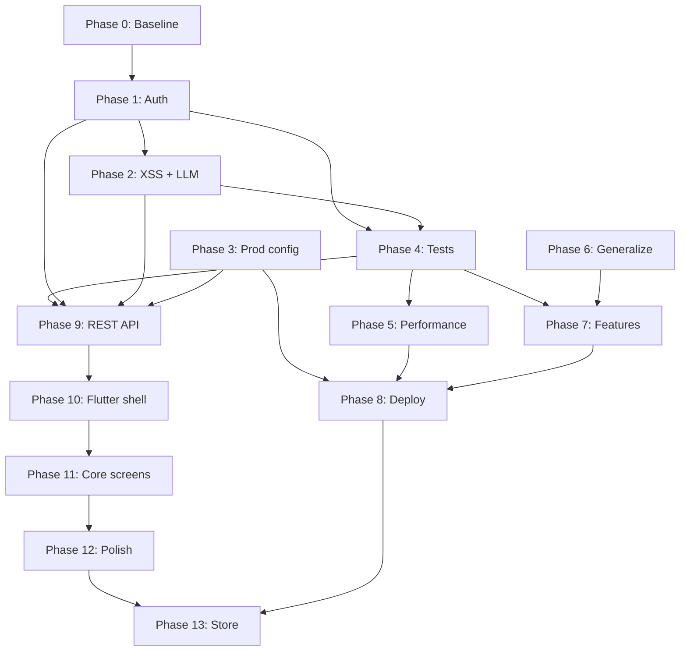

# Trip Planner App — Phased Hardening & Maturity Plan

A phased roadmap from **pre-alpha prototype** to **deployable product**, with **SMART goals** per phase. Estimates assume one developer working part-time (~10–15 hrs/week). Adjust timelines to your pace.

**Platforms today:** Django web app only (responsive mobile browser, not a native app).  
**Platforms planned:** Web + **Flutter companion app** (iOS/Android) — see [MOBILE_FLUTTER.md](./MOBILE_FLUTTER.md).

---

## Monorepo layout (target)

Single git repo; Django stays at root; Flutter app added under `mobile/` when Phase 10 starts.

```
trip_planner_app/
├── plan/                 # ROADMAP.md + MOBILE_FLUTTER.md
├── core/                 # Django project
├── itinerary/            # models, services, web views, api/ (Phase 9)
├── templates/            # Web UI (HTMX)
├── static/
├── mobile/               # Flutter companion (Phase 10+) — not created yet
├── pyproject.toml
└── README.md
```

---

## How to read SMART goals here

Each goal uses:

| Letter | Meaning in this plan |
|--------|----------------------|
| **S** | Specific deliverable (file, behavior, test) |
| **M** | Measurable pass/fail criteria |
| **A** | Achievable within the phase scope |
| **R** | Relevant to audit findings |
| **T** | Target window within the phase |

---

## Phase 0 — Baseline & Documentation Discovery

**Duration:** 2–3 days  
**Outcome:** Shared understanding of current state; no behavior changes yet.

### Goal 0.1 — Inventory & risk register

- **S:** Document all 20+ view endpoints, their auth checks, and external integrations (Ollama, Gemini, Places, Weather).
- **M:** A table exists mapping every URL in `itinerary/urls.py` → view → ownership check (yes/no) → XSS risk (yes/no).
- **A:** One pass through `views.py` and `urls.py` is enough.
- **R:** Prevents missed IDOR/XSS fixes in later phases.
- **T:** Complete by end of day 1.

### Goal 0.2 — Environment & runbook draft

- **S:** Write `README.md` covering: `uv sync`, `.env` vars (`SECRET_KEY`, `GEMINI_API_KEY`, `GOOGLE_PLACES_API_KEY`, `WEATHER_API_KEY`, `OLLAMA_URL`), migrate, runserver, seed vs AI create.
- **M:** A new developer can run the app from README alone in <30 minutes.
- **A:** README only; no deployment yet.
- **R:** Unblocks onboarding and Phase 3 prod config.
- **T:** Complete by end of day 3.

### Goal 0.3 — Allowed patterns list (Django)

- **S:** Confirm patterns to use: `get_object_or_404` + ownership filter, `transaction.atomic()`, `django.utils.html.escape` / `format_html`, `select_related` / `prefetch_related`, `TestCase` + `Client`.
- **M:** Short "Allowed APIs" section in README or `docs/CONVENTIONS.md` with links to Django 6 docs.
- **A:** No new libraries required.
- **R:** Stops invented patterns in later phases.
- **T:** Complete by end of day 3.

**Phase 0 exit criteria:** Risk register done; README runnable; conventions documented.

---

## Phase 1 — Authorization & Data Ownership (Critical)

**Duration:** 1 week  
**Outcome:** No cross-user trip access.

### Goal 1.1 — Central ownership helper

- **S:** Add `itinerary/permissions.py` with `get_trip_for_user(request, trip_id)` and chained helpers (`get_day_for_user`, `get_stop_for_user`, etc.).
- **M:** Helper returns 404 (not 403) when trip exists but `trip.user != request.user`; used in 100% of trip-scoped views.
- **A:** ~50 lines; refactor views incrementally.
- **R:** Fixes critical IDOR from audit.
- **T:** Days 1–2.

**Ownership rule:** `trip.user == request.user` only. Remove `Q(user__isnull=True)` from dashboard.

### Goal 1.2 — Migrate orphan trips

- **S:** Data migration or management command assigning `user=NULL` trips to a designated owner (or delete dev seeds).
- **M:** `Trip.objects.filter(user__isnull=True).count() == 0` after migration.
- **A:** One-off script + migration.
- **R:** Closes shared-trip loophole.
- **T:** Day 3.

### Goal 1.3 — Enforce ownership on all endpoints

- **S:** Update every view using `trip_id`, `day_id`, `stop_id`, `item_id`, `photo_id` to go through ownership helpers.
- **M:** Manual test: User A cannot read/edit User B's trip at `/trip/{id}/`, `/stop/{id}/edit/`, `/day/{id}/notes/`, etc.
- **A:** Grep for `get_object_or_404(Trip` and eliminate unscoped lookups.
- **R:** Complete IDOR remediation.
- **T:** Days 4–5.

### Goal 1.4 — Authorization tests

- **S:** Add `itinerary/tests/test_permissions.py` with ≥8 cases (own trip OK, other user's trip 404, orphan trip inaccessible).
- **M:** `uv run python manage.py test itinerary.tests.test_permissions` passes; CI-ready.
- **A:** Django `TestCase` + two test users.
- **R:** Regression guard for Phase 1.
- **T:** Days 6–7.

**Phase 1 exit criteria:** All permission tests green; `user__isnull=True` removed; zero unscoped trip lookups.

---

## Phase 2 — Input Safety & LLM Mutation Hardening

**Duration:** 1 week  
**Outcome:** No XSS via HTMX fragments; safe AI-driven DB writes.

### Goal 2.1 — Escape all raw `HttpResponse` HTML

- **S:** Fix `chat_edit`, `get_stop_reviews`, `toggle_checklist_item`, `parse_booking_pdf`, and error paths to use `escape()` or small template partials.
- **M:** Payload `<script>alert(1)</script>` in chat message renders as text, not executed; grep shows no f-string HTML with unescaped user/LLM content.
- **A:** Prefer template partials over manual escaping where possible.
- **R:** Fixes reflected/stored XSS.
- **T:** Days 1–3.

### Goal 2.2 — LLM mutation allowlist

- **S:** In `chat_edit`, define `ALLOWED_STOP_FIELDS` frozenset; filter `fields` before `update()` / `create()`; reject unknown keys.
- **M:** LLM response with `"day": 999` or `"id": 1` is ignored; only whitelisted fields persist.
- **A:** ~30 lines in `views.py` or `services/mutations.py`.
- **R:** Prevents arbitrary field injection.
- **T:** Days 3–4.

### Goal 2.3 — Atomic mutations

- **S:** Wrap `chat_edit` mutation loop in `transaction.atomic()`; on failure, roll back all changes.
- **M:** Simulated mid-loop exception leaves stop count unchanged (test with mock).
- **A:** One decorator/context manager.
- **R:** Fixes misleading comment + partial-state bugs.
- **T:** Day 4.

### Goal 2.4 — CREATE validation

- **S:** Validate required fields on CREATE (`title`, `latitude`, `longitude`, `sequence_order`); coerce types; default safe values.
- **M:** CREATE with missing `title` returns user-visible error, no DB row.
- **A:** Simple validator function.
- **R:** Data integrity for AI-created stops.
- **T:** Days 5–6.

### Goal 2.5 — Safety tests

- **S:** Tests for XSS escaping, allowlist filtering, and atomic rollback.
- **M:** ≥6 new tests in `test_security.py`; all pass.
- **A:** Extends Phase 1 test setup.
- **R:** Locks in Phase 2.
- **T:** Day 7.

**Phase 2 exit criteria:** Security tests green; no raw user content in f-string HTML; mutations transactional and allowlisted.

---

## Phase 3 — Production Configuration & Secrets

**Duration:** 4–5 days  
**Outcome:** Safe to deploy behind HTTPS without leaking keys.

### Goal 3.1 — Split settings

- **S:** Refactor to `core/settings/base.py`, `dev.py`, `prod.py`; `manage.py` / `wsgi.py` use env `DJANGO_SETTINGS_MODULE`.
- **M:** Prod settings: `DEBUG=False`, no insecure `SECRET_KEY` fallback, explicit `ALLOWED_HOSTS`, `CSRF_TRUSTED_ORIGINS`.
- **A:** Standard Django pattern.
- **R:** Addresses audit prod-config findings.
- **T:** Days 1–2.

### Goal 3.2 — Secure cookies & headers (prod)

- **S:** Enable `SECURE_SSL_REDIRECT`, `SESSION_COOKIE_SECURE`, `CSRF_COOKIE_SECURE`, `SECURE_HSTS_SECONDS` (when HTTPS confirmed).
- **M:** `python manage.py check --deploy` passes with only documented warnings.
- **A:** Settings flags only.
- **R:** Production baseline.
- **T:** Day 3.

### Goal 3.3 — Google Places photo proxy

- **S:** Add `proxy_place_photo(request, photo_ref)` view; store photo references, not key-bearing URLs; serve images server-side.
- **M:** Browser network tab shows no `key=` in image URLs; Places API key not in client HTML/JSON.
- **A:** One view + template/JSON URL change.
- **R:** Stops API key leakage.
- **T:** Days 4–5.

### Goal 3.4 — HTTPS for external APIs

- **S:** Change WeatherAPI URL from `http://` to `https://`; add request timeouts consistently (5s).
- **M:** Grep shows no `http://api.` in app code.
- **A:** One-line fix.
- **R:** Minor security hygiene.
- **T:** Day 5.

**Phase 3 exit criteria:** `check --deploy` clean; photo proxy live; prod settings documented in README.

---

## Phase 4 — Test Suite & CI

**Duration:** 1 week  
**Outcome:** Automated regression safety net.

### Goal 4.1 — Core view tests

- **S:** Tests for auth flow (register, login, logout), dashboard scoping, `create_trip` (mocked LLM), `trip_detail`, `save_notes`, `reorder_stops`.
- **M:** ≥20 tests; coverage ≥60% on `views.py` (measure with `coverage`).
- **A:** Mock `LLMService` to avoid real API calls.
- **R:** Sustainable development.
- **T:** Days 1–4.

### Goal 4.2 — LLM service tests

- **S:** Tests for JSON parsing, markdown fence stripping, and error handling in `llm.py`.
- **M:** ≥8 tests with fixture JSON strings; no network calls.
- **A:** Pure unit tests.
- **R:** AI is core product risk.
- **T:** Days 5–6.

### Goal 4.3 — CI pipeline

- **S:** GitHub Actions workflow: `uv sync`, `migrate`, `test`, `check --deploy` (with test settings).
- **M:** Green CI on every push to main; badge in README.
- **A:** Single `.github/workflows/ci.yml`.
- **R:** Prevents regressions.
- **T:** Day 7.

**Phase 4 exit criteria:** CI green; ≥28 total tests; coverage report generated.

---

## Phase 5 — Performance & Reliability

**Duration:** 1 week  
**Outcome:** Faster pages; non-blocking AI creation.

### Goal 5.1 — Query optimization

- **S:** Add `prefetch_related('days__stops', 'attendees', 'checklist_items')` on trip detail/dashboard; fix N+1 on dashboard `attendees.count()`.
- **M:** `django-debug-toolbar` or `assertNumQueries` shows ≤5 queries on `trip_detail` (vs current ~15+).
- **A:** View-level queryset tuning.
- **R:** Audit N+1 findings.
- **T:** Days 1–2.

### Goal 5.2 — Model property optimization

- **S:** Replace Python-loop `total_cost_local` with DB `Sum()` aggregation or cached field updated on stop save.
- **M:** Dashboard with 5 trips × 10 days × 8 stops loads in <200ms locally.
- **A:** `annotate()` or signal-based cache.
- **R:** Scales beyond demo data.
- **T:** Days 3–4.

### Goal 5.3 — Async trip creation (optional but recommended)

- **S:** Background job for `create_trip` (Django-Q, RQ, or Celery); HTMX polls status endpoint.
- **M:** HTTP response returns in <2s; user sees progress UI; trip appears when job completes.
- **A:** Start with RQ + Redis if acceptable; else threaded in-process queue for MVP.
- **R:** 20s blocking request is poor UX.
- **T:** Days 5–7.

### Goal 5.4 — PlaceDetail cache TTL

- **S:** Enforce 7-day refresh using `updated_at`; refetch when stale.
- **M:** Test proves cache refreshes after forced `updated_at` backdate.
- **A:** Small change in `get_stop_reviews`.
- **R:** Fixes comment/code mismatch.
- **T:** Day 7 (can parallelize).

**Phase 5 exit criteria:** Query count targets met; trip creation non-blocking or documented as deferred.

---

## Phase 6 — Product Generalization

**Duration:** 1 week  
**Outcome:** Works for any user/destination, not just Baku family trip.

### Goal 6.1 — Dynamic attendees

- **S:** Replace keyword heuristic in `create_trip` with form fields (names/roles) or LLM-parsed attendee list from `details`.
- **M:** Creating trip without "toddler" in details does not inject "Abdul Jawad"; attendees match user input.
- **A:** Form + prompt tweak.
- **R:** Removes personal hardcoding.
- **T:** Days 1–2.

### Goal 6.2 — Neutral UI copy & icons

- **S:** Remove hardcoded 🇦🇿, "Hi Abdul Jawad", Baku-specific tips from templates; use `trip.destination` for context.
- **M:** Grep for `Abdul`, `Eesa`, `Baku` in templates/views returns only seed scripts.
- **A:** Template edits.
- **R:** General product feel.
- **T:** Days 3–4.

### Goal 6.3 — Seed scripts → management commands

- **S:** Move `seed_baku.py`, `parse_and_seed.py` to `itinerary/management/commands/`; assign trip to `--user` flag.
- **M:** `python manage.py seed_baku --user jawad` creates owned trip; not visible to others.
- **A:** Django management command pattern.
- **R:** Dev data without security holes.
- **T:** Days 5–6.

### Goal 6.4 — Honest mock labeling

- **S:** When using mock weather/reviews, prefix UI with "Estimated" or "Demo data".
- **M:** Mock responses visually distinct from live API data.
- **A:** Template conditional on `settings` / response metadata.
- **R:** Avoids misleading users.
- **T:** Day 7.

**Phase 6 exit criteria:** No personal names in production paths; seeds are dev-only and user-scoped.

---

## Phase 7 — Feature Completeness

**Duration:** 1.5 weeks  
**Outcome:** Stubs replaced or clearly labeled.

### Goal 7.1 — Real PDF parsing

- **S:** Add `pypdf` (or `pdfplumber`); extract text from uploaded PDF in `parse_booking_pdf`.
- **M:** Upload real flight confirmation PDF → structured booking with correct ref number (manual test).
- **A:** One dependency + ~40 lines.
- **R:** Booking import is currently fake.
- **T:** Days 1–3.

### Goal 7.2 — Booking fields wired

- **S:** Persist `start_time`, `end_time` from `LLMService.parse_booking`; display on bookings tab.
- **M:** Parsed ISO times appear in UI; migration if needed.
- **A:** Small view + template update.
- **R:** Model fields already exist, unused.
- **T:** Days 4–5.

### Goal 7.3 — File upload validation

- **S:** Server-side image type (Pillow verify), max size (e.g. 5MB), PDF max size (e.g. 10MB).
- **M:** Upload of `.exe` renamed as `.jpg` rejected; oversized file returns 400.
- **A:** Validator functions in views.
- **R:** Upload security gap.
- **T:** Days 6–7.

### Goal 7.4 — Django admin registration

- **S:** Register all models in `admin.py` with useful list filters (`Trip`, `DayItinerary`, `StopBlock`).
- **M:** Staff user can inspect/edit trips via `/admin/`.
- **A:** Standard admin config.
- **R:** Operational tooling.
- **T:** Days 8–9.

### Goal 7.5 — Gemini graceful degradation

- **S:** When Ollama fails and `GEMINI_API_KEY` is empty, return clear user error instead of 500.
- **M:** Test with both services down shows friendly message on create form.
- **A:** Exception handling in `LLMService.query`.
- **R:** Better DX without cloud keys.
- **T:** Day 10.

**Phase 7 exit criteria:** PDF import works; uploads validated; admin usable; AI errors user-friendly.

---

## Phase 8 — Deployment & Observability

**Duration:** 1 week  
**Outcome:** Deployable to staging with monitoring basics.

### Goal 8.1 — Deployment target chosen & documented

- **S:** Pick platform (Fly.io, Railway, Render, VPS); document deploy steps in README.
- **M:** Staging URL loads over HTTPS; env vars documented.
- **A:** One platform, one environment.
- **R:** Moves from localhost-only.
- **T:** Days 1–3.

### Goal 8.2 — Production database

- **S:** Switch prod to PostgreSQL; keep SQLite for dev.
- **M:** `DATABASE_URL` in prod; migrations apply cleanly.
- **A:** `dj-database-url` or equivalent.
- **R:** SQLite unsuitable for multi-user prod.
- **T:** Days 3–4.

### Goal 8.3 — Static/media storage

- **S:** `collectstatic` + WhiteNoise or CDN; S3-compatible storage for `StopPhoto` / `Booking.attachment` in prod.
- **M:** Uploaded photos persist across deploys.
- **A:** `django-storages` optional.
- **R:** Media on local disk breaks on PaaS.
- **T:** Days 5–6.

### Goal 8.4 — Logging & rate limits

- **S:** Structured logging for LLM/external API failures; rate limit `create_trip` and `chat_edit` (e.g. django-ratelimit: 10/hour/user).
- **M:** Logs visible in platform dashboard; 11th AI request in 1 hour returns 429.
- **A:** Middleware or decorator.
- **R:** Cost/abuse protection.
- **T:** Day 7.

**Phase 8 exit criteria:** Staging deployed; Postgres + media storage; rate limits active.

---

## Mobile companion track (Flutter)

Full detail: **[plan/MOBILE_FLUTTER.md](./MOBILE_FLUTTER.md)**

Phases 9–13 add a **Flutter hybrid app** (`mobile/`) sharing the same Django backend via a new **REST API** (`/api/v1/`). Web HTMX UI remains; mobile is a companion (read + light edit + map + AI chat), not a full web clone in v1.

| Phase | Focus | Duration | Blocked by |
|-------|--------|----------|------------|
| **9** | REST API + JWT + shared services | 1.5 weeks | Web Phases 1–4 |
| **10** | Flutter shell, auth, routing | 1 week | Phase 9 (health + auth) |
| **11** | Core screens (trips, map, checklist, chat) | 2 weeks | Phase 10 |
| **12** | Offline cache, camera, simplified timeline | 1.5 weeks | Phase 11 |
| **13** | CI, flavors, TestFlight / Play Internal | 1 week | Phase 12 + Web Phase 8 |

**Do not start Phase 9 until Web Phase 1 (auth) is complete** — mobile inherits the same ownership rules.

---

## Master timeline (summary)

### Web track (Phases 0–8)

| Phase | Focus | Duration | Cumulative |
|-------|--------|----------|------------|
| 0 | Baseline & docs | 2–3 days | ~3 days |
| 1 | Authorization (critical) | 1 week | ~10 days |
| 2 | XSS & LLM safety | 1 week | ~17 days |
| 3 | Prod config & secrets | 4–5 days | ~22 days |
| 4 | Tests & CI | 1 week | ~29 days |
| 5 | Performance & async AI | 1 week | ~36 days |
| 6 | Generalization | 1 week | ~43 days |
| 7 | Feature completeness | 1.5 weeks | ~53 days |
| 8 | Deployment | 1 week | ~60 days |

**~8–10 weeks part-time** for web maturity. **Phases 1–3** (~3 weeks) are the minimum before sharing with other users.

### Mobile track (Phases 9–13, after web Phase 4)

| Phase | Focus | Duration | Cumulative |
|-------|--------|----------|------------|
| 9 | REST API | 1.5 weeks | ~10 days |
| 10 | Flutter foundation | 1 week | ~17 days |
| 11 | Core companion screens | 2 weeks | ~31 days |
| 12 | Polish + offline | 1.5 weeks | ~42 days |
| 13 | Store release | 1 week | ~49 days |

**~10–12 weeks part-time** for mobile after web Phases 1–4. Web Phases 5–8 can run in parallel with Phases 9–12.

**Combined part-time estimate:** ~18–22 weeks for web hardening + deploy + mobile internal release.

---

## Dependency graph



**Do not skip Phase 1.** Phases 5–8 can be reordered after Phase 4 except deploy (Phase 8) depends on Phase 3. **Do not skip Phase 1 before Phase 9 (mobile API).**

---

## Suggested execution prompts (for `do` skill or new chats)

Each phase can be handed to an agent as a self-contained task:

1. **Phase 1:** "Implement `get_trip_for_user` in `itinerary/permissions.py` and refactor all views in `itinerary/views.py` to use it. Remove `user__isnull=True` from dashboard. Add `test_permissions.py` with 8+ tests."
2. **Phase 2:** "Escape all raw HTML in `views.py` chat/reviews/checklist responses. Add LLM mutation allowlist + `transaction.atomic()` in `chat_edit`. Add `test_security.py`."
3. **Phase 3:** "Split settings into base/dev/prod. Add Google Places photo proxy. Run `check --deploy`."
4. **Phase 9:** "Add DRF + JWT under `itinerary/api/`. Trips/days/stops endpoints with ownership. See MOBILE_FLUTTER.md."
5. **Phase 10:** "Create Flutter app in `mobile/`. Dio + JWT + Riverpod + login/register."

---

## Success metrics (project-level)

| Metric | Current | Target (post Phase 4) | Target (post Phase 8) | Target (post Phase 13) |
|--------|---------|------------------------|------------------------|-------------------------|
| Authorization tests | 0 | ≥8 | ≥8 | ≥8 |
| Total tests | 0 | ≥28 | ≥40 | ≥55 (+ API + Flutter) |
| IDOR vulnerabilities | Many | 0 | 0 | 0 |
| XSS in HTMX fragments | Yes | 0 | 0 | N/A (mobile uses JSON) |
| `check --deploy` (prod settings) | Fails | Passes | Passes | Passes |
| README completeness | Empty | Runnable locally | Deploy guide included | + mobile run instructions |
| Cross-user trip access | Possible | Blocked | Blocked | Blocked |
| Native mobile app | None | — | — | iOS + Android internal builds |
| Shared API (`/api/v1/`) | None | — | — | Documented + tested |

---

## Audit context

This roadmap was derived from a critical review of the trip planner app (June 2026). Key findings that motivated these phases:

- **Critical:** Missing object-level authorization (IDOR) on all trip/day/stop endpoints
- **High:** XSS in raw `HttpResponse` HTML fragments; unvalidated LLM `**fields` DB mutations
- **High (if deployed):** Insecure defaults (`DEBUG`, `SECRET_KEY`, `ALLOWED_HOSTS`)
- **Medium:** Google API key exposed in photo URLs; no file upload validation
- **Gaps:** No tests, empty README, stub PDF parsing, hardcoded Baku/personal data
